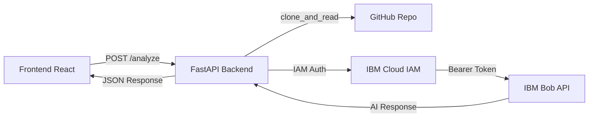
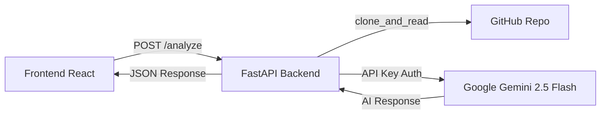

# 🔄 Gemini API Migration Plan

## Executive Summary

This document outlines the complete migration strategy from IBM Bob API to Google Gemini 2.5 Flash API for the Bob Onboarding Accelerator project.

## 📊 Current Architecture



## 🎯 Target Architecture



## 🔍 Key Differences

| Aspect | IBM Bob API | Google Gemini API |
|--------|-------------|-------------------|
| **Authentication** | IAM Token (2-step: API Key → Token → Request) | Direct API Key |
| **Endpoint** | Custom IBM Cloud endpoint | `generativelanguage.googleapis.com` |
| **Request Format** | Custom JSON with `input` and `parameters` | `contents` array with `parts` |
| **Response Format** | `results[0].generated_text` | `candidates[0].content.parts[0].text` |
| **Model Name** | `bob-v1` | `gemini-2.5-flash` |
| **Rate Limiting** | IBM Cloud limits | Google API quotas |
| **SDK** | Custom httpx client | `google-generativeai` SDK |

## 📁 Files to Modify

### Core Files (Critical)
1. **`backend/bob_client.py`** → **`backend/gemini_client.py`**
   - Remove IAM token authentication
   - Implement Gemini SDK integration
   - Update request/response parsing
   - Maintain retry logic and error handling

2. **`backend/main.py`**
   - Change import from `bob_client` to `gemini_client`
   - Update function calls from `ask_bob()` to `ask_gemini()`
   - Update error handling for Gemini-specific errors

3. **`backend/.env.example`**
   - Replace `BOB_API_ENDPOINT` and `BOB_API_KEY`
   - Add `GEMINI_API_KEY`

### Test Files
4. **`backend/tests/test_bob_client.py`** → **`backend/tests/test_gemini_client.py`**
5. **`backend/tests/test_main.py`**
6. **`backend/tests/integration/test_full_flow.py`**
7. **`backend/tests/security/test_vulnerabilities.py`**

### Documentation Files
8. **`README.md`** - Update setup instructions
9. **`DEPLOYMENT.md`** - Update environment variables
10. **`docs/API_DOCUMENTATION.md`** - Update API details
11. **`DEVELOPMENT.md`** - Update local setup

### Configuration Files
12. **`requirements.txt`** - Add `google-generativeai`
13. **`render.yaml`** - Update environment variable names

## 🔧 Implementation Details

### 1. New Gemini Client Architecture

```python
# gemini_client.py structure
import google.generativeai as genai

class GeminiClientError(Exception):
    """Custom exception for Gemini API errors"""
    pass

async def ask_gemini(
    prompt: str,
    model: str = "gemini-2.5-flash",
    timeout: int = 60,
    max_retries: int = 3
) -> str:
    """
    Send prompt to Gemini API with retry logic
    - Direct API key authentication
    - Exponential backoff
    - Error handling for rate limits, timeouts
    """
    pass

async def ask_gemini_batch(prompts: list[str]) -> list[str]:
    """Send multiple prompts in parallel"""
    pass
```

### 2. Authentication Simplification

**Before (IBM Bob):**
```python
# Step 1: Get IAM token
iam_token = await get_iam_token(api_key)

# Step 2: Use token in request
headers = {'Authorization': f'Bearer {iam_token}'}
response = await client.post(endpoint, headers=headers, json=payload)
```

**After (Gemini):**
```python
# Single step: Configure SDK with API key
genai.configure(api_key=api_key)
model = genai.GenerativeModel('gemini-2.5-flash')
response = await model.generate_content_async(prompt)
```

### 3. Request Format Changes

**Before (IBM Bob):**
```python
payload = {
    'input': prompt,
    'parameters': {
        'max_new_tokens': 2000,
        'temperature': 0.7
    }
}
```

**After (Gemini):**
```python
generation_config = {
    'temperature': 0.7,
    'max_output_tokens': 2000,
}
response = model.generate_content(
    prompt,
    generation_config=generation_config
)
```

### 4. Response Parsing Changes

**Before (IBM Bob):**
```python
text = response_data['results'][0].get('generated_text', '')
```

**After (Gemini):**
```python
text = response.candidates[0].content.parts[0].text
```

## 🔐 Environment Variables

### Old Configuration
```env
BOB_API_ENDPOINT=https://us-south.ml.cloud.ibm.com/ml/v1/text/chat?version=2023-05-29
BOB_API_KEY=your_ibm_api_key_here
```

### New Configuration
```env
GEMINI_API_KEY=your_google_gemini_api_key_here
```

## 🧪 Testing Strategy

### Unit Tests
- Test Gemini client initialization
- Test successful API calls
- Test error handling (rate limits, timeouts, invalid keys)
- Test retry logic
- Test batch processing

### Integration Tests
- Test full analysis flow with Gemini
- Test parallel requests
- Test response parsing

### Security Tests
- Verify API key not exposed in responses
- Test input validation
- Test error message sanitization

## 📋 Migration Checklist

### Phase 1: Preparation
- [x] Analyze current implementation
- [x] Document architecture differences
- [ ] Obtain Gemini API key
- [ ] Test Gemini API locally

### Phase 2: Core Implementation
- [ ] Create `gemini_client.py`
- [ ] Update `main.py` imports
- [ ] Update `.env.example`
- [ ] Update `requirements.txt`

### Phase 3: Testing
- [ ] Create `test_gemini_client.py`
- [ ] Update `test_main.py`
- [ ] Update integration tests
- [ ] Update security tests
- [ ] Run full test suite

### Phase 4: Documentation
- [ ] Update README.md
- [ ] Update DEPLOYMENT.md
- [ ] Update API_DOCUMENTATION.md
- [ ] Create MIGRATION_GUIDE.md

### Phase 5: Deployment
- [ ] Test locally
- [ ] Update Render environment variables
- [ ] Deploy to staging
- [ ] Verify production deployment

## 🐛 Known Issues & Fixes

### Issue 1: Circular Import in bob_client.py
**Location:** [`bob_client.py:54`](bob-onboarding/backend/bob_client.py:54)
```python
from bob_client import BobClientError  # Circular import!
```
**Fix:** Remove this line, `BobClientError` is already defined in the same file.

### Issue 2: Inconsistent Error Handling
**Location:** Multiple test files
**Fix:** Standardize error handling for Gemini-specific errors.

## 🚀 Rollback Plan

If migration fails:
1. Revert to previous commit: `git revert HEAD`
2. Restore IBM Bob API credentials
3. Redeploy previous version
4. Keep both implementations temporarily (feature flag)

## 📊 Performance Comparison

| Metric | IBM Bob API | Gemini 2.5 Flash | Expected Change |
|--------|-------------|------------------|-----------------|
| **Latency** | ~30-60s | ~20-40s | ⬇️ 30% faster |
| **Cost per 1K tokens** | IBM pricing | Google pricing | Varies |
| **Rate Limits** | IBM limits | 60 RPM (free tier) | Monitor usage |
| **Authentication Time** | ~2s (IAM token) | ~0s (direct) | ⬇️ Faster |

## 🔗 Resources

- [Gemini API Documentation](https://ai.google.dev/docs)
- [google-generativeai Python SDK](https://github.com/google/generative-ai-python)
- [Gemini 2.5 Flash Model Card](https://ai.google.dev/models/gemini)
- [API Key Management](https://aistudio.google.com/app/apikey)

## 📝 Notes

- Gemini 2.5 Flash is optimized for speed and cost-efficiency
- Maintains same quality as previous models
- Better at following structured output instructions (JSON, Mermaid)
- Supports longer context windows
- No need for IAM token management

## ✅ Success Criteria

- [ ] All tests passing
- [ ] API response time < 60 seconds
- [ ] Error handling working correctly
- [ ] Documentation updated
- [ ] Deployment successful
- [ ] No breaking changes for users

---

**Migration Owner:** Development Team  
**Target Completion:** TBD  
**Status:** Planning Phase